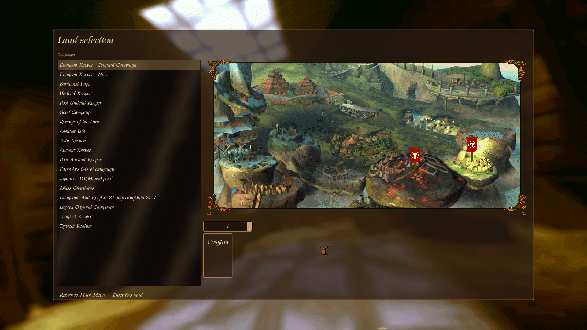
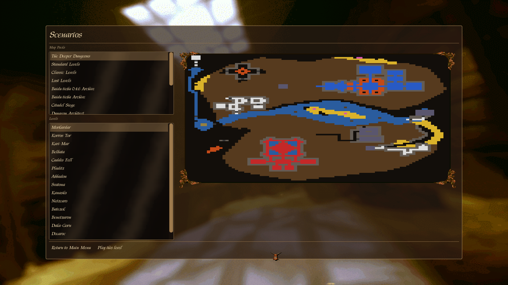
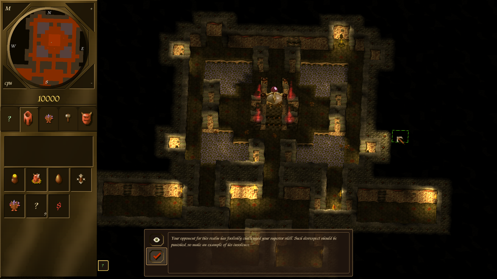

## Intro

This is an independent fork of **KeeperFX** (Dungeon Keeper Fan eXpansion), the
open-source project that fixes up, enhances and modernizes Bullfrog's classic
dungeon-management game, [Dungeon Keeper](https://en.wikipedia.org/wiki/Dungeon_Keeper).

The upstream KeeperFX project began as a decompilation of the original game
executables; over the years the entire codebase was rewritten in C/C++. This
fork continues from that rewritten codebase and focuses on **structural
modernization**: `src/` has been refactored from one flat 266-file directory
into a set of internal libraries with a strict, enforced dependency graph, the
platform layer has moved to SDL3, and the build now produces first-class
**native Linux** binaries alongside the Windows build, all driven by CMake.

KeeperFX is a standalone game but requires a copy of the original Dungeon Keeper
data files as proof of ownership. These can be copied from an old CD or from a
digital edition (EA, GOG, Steam).

### Relationship to the upstream project

This fork is **not affiliated with the KeeperFX team** and is maintained
separately. Please direct issues, questions and pull requests **about this fork**
to [this repository](https://github.com/edorien/keeperfx-refactor) — not to the
upstream project's Discord, forums or issue tracker.

For the original project, its community and its official releases, see
[keeperfx.net](https://keeperfx.net). All credit for the original reimplementation
work belongs to the KeeperFX project and the Keeper Klan community (see
[Acknowledgements](#acknowledgements)).

## Features

Everything from upstream KeeperFX, including:

- Windows 7/10/11 support
- Higher screen resolutions
- Increased FPS, with graphics decoupled from game logic
- Improved and modernized controls
- Many bugfixes over the original game
- Map, campaign and modding customizability
- Lua scripting for campaigns and maps
- Improved computer-player AI
- Additional campaigns, maps, creatures and other content

This fork additionally provides:

- **Native Linux builds** — a real ELF binary, not a Wine wrapper, portable
  enough to copy to a machine that never ran the build
- **CMake** as the single build definition for every target (native Linux,
  Windows via MSVC/clang-cl, and Windows via mingw-w64 cross-compile), with
  third-party dependencies fetched and built automatically
- A **layered architecture**: `src/` is split into internal libraries
  (`kfx_platform`, `kfx_config`, `kfx_pathfinding`, `kfx_sim`, `kfx_render`,
  `kfx_net`, `kfx_game`, `kfx_frontend`, `kfx_script`, `kfx_apploop`) with a
  one-directional, acyclic dependency graph enforced in CI
- The old ~176-field `struct Game` god-object broken up into per-library state
- Frontend/Options-screen and campaign-progress reworks
- Note: Multiplayer is **not** compatible with original KeeperFX

## Roadmap

Direction of this fork. "AI-assisted" means the work was carried out with heavy
use of AI coding tools.

| Phase                         | Status                | Scope                                                                                                                                                                                                                                                                       |
| ----------------------------- | --------------------- | --------------------------------------------------------------------------------------------------------------------------------------------------------------------------------------------------------------------------------------------------------------------------- |
| **1. Refactor**               | done · AI-assisted    | Split the codebase into separate libraries with an enforced dependency graph; fix the declaration mess (functions not declared in headers, etc.); replace the 3 build systems across 2 platforms with a single CMake build; add a test harness with >50% function coverage. |
| **2. Render enhancement**     | done · AI-assisted    | Compare the decompiled `keepd3d.exe` against `keeper.exe` and `keeper95.exe` and work out the 8→32-bit conversion tables; move to a 32-bit renderer while staying software-based, skipping the Direct3D version's extreme anisotropic filtering and antialiasing.           |
| **3. Modernise the GUI**      | done · AI-assisted    | Switch to a vector-based GUI; collapse the multi-screen campaign / scenario / skirmish flows into single screens; make every setting controllable from within the game. Reworked sidebar plus a horizontal DK2-style / DK-beta layout with floating icons.                  |
| **3b. Skirmish setup screen** | planned · AI-assisted | Dedicated skirmish setup screen.                                                                                                                                                                                                                                            |
| **3c. Legacy consistency**    | planned               | Bring the modernised in-game GUI back into line with the legacy look where it drifted.                                                                                                                                                                                      |
| **4. In-game editors**        | planned               | Level editor and script editor inside the game.                                                                                                                                                                                                                             |
| **5. The fun bit**            | planned               | Optimise the AI & pathfinding<br/>Try to implement features Molyneux showed in early previews that never shipped: e.g. hero mode (heroes invading the dungeon before the level starts), AI Keeper with cross-session memory.                                                |

### Phase 3 — single-screen menu flows

The old multi-screen campaign / scenario routes are now one screen each: pick a
campaign or map pack on the left, preview the land or level on the right, enter.

| Land selection (campaigns)                                                     | Scenarios (map packs)                                                     |
| ------------------------------------------------------------------------------ | ------------------------------------------------------------------------- |
| [](docs/assets/landview.png) | [](docs/assets/scenario.png) |

Reworked sidebar and HUD over the 32-bit software renderer from phase 2.

[](docs/assets/ingame.png)

## How to play

You need the original Dungeon Keeper data files, from an old CD or from the
digital edition available on
[EA](https://www.ea.com/games/dungeon-keeper/dungeon-keeper),
[GOG](https://www.gog.com/game/dungeon_keeper) or
[Steam](https://store.steampowered.com/app/1996630/Dungeon_Keeper_Gold/).

General installation guidance and an FAQ for KeeperFX are on the upstream
[GitHub Wiki](https://github.com/dkfans/keeperfx/wiki). Which files the game
needs from the original release is documented in
[docs/files_required_from_original_dk.txt](docs/files_required_from_original_dk.txt).

## Development

The build is CMake-based and fetches / builds its own third-party dependencies
(SDL3, OpenAL, ffmpeg, LuaJIT, …), so a machine with just a C/C++ toolchain,
`cmake`, `ninja` and `pkg-config` can build end-to-end. There are two produced
binaries — `keeperfx` and `keeperfx_hvlog` — identical apart from the verbose
debug logging compiled into the `_hvlog` variant.

### Linux (native)

Needs `gcc`/`g++`, `cmake`, `ninja`, `pkg-config`. Everything else is fetched.

```bash
KFX_OS=linux ./build-cmake.sh                 # build out/linux/keeperfx
KFX_OS=linux ./build-cmake.sh keeperfx_hvlog  # heavy-log variant
KFX_OS=linux ./build-package.sh               # full package -> dist/linux/
```

### Windows

**Cross-compiled from Linux** (this is what CI runs) — needs a MinGW-w64 i686
toolchain (`g++-mingw-w64-i686`), `cmake`, `ninja`:

```bash
./build-cmake.sh                 # build out/windows/keeperfx.exe
./build-cmake.sh keeperfx_hvlog  # heavy-log variant
USE_DOCKER=1 ./build-cmake.sh    # do it in an Ubuntu 24.04 container
```

**Natively on Windows** — from an [MSYS2](https://www.msys2.org) *MINGW32*
environment with `mingw-w64-i686-{gcc,cmake,ninja}`, `make`, `git`, `p7zip`,
`curl`, `unzip` installed:

```bat
build-package-windows.bat        REM MinGW build + full package -> pkg\*.7z and dist\windows\
```

Run it from an ordinary Command Prompt; it boots MSYS2 and calls
`build-package-windows.sh` (which also works if run directly from a MINGW32
shell). It does not do the Linux build or the coverage pass.

- Build details, layout and conventions: [CLAUDE.md](CLAUDE.md)
- Architecture (authoritative, kept current): [docs/Architecture/architecture.md](docs/Architecture/architecture.md)
- Refactor history and design rationale: [docs/refactor/](docs/refactor/)
- Layering check (CI-blocking): `python3 scripts/check_layering.py --strict`

Tests:

- In-game functional tests: `src/ftests/` (run with `-ftests`) — see
  [src/ftests/README.md](src/ftests/README.md)
- Standalone CUnit programs: `tests/`

## Components

These are resources of the **upstream** KeeperFX project. This fork tracks the
game engine only; it reuses upstream's asset and infrastructure repositories.

| Component                                                       | Language  | Info                                                 |
| --------------------------------------------------------------- | --------- | ---------------------------------------------------- |
| [KeeperFX](https://github.com/dkfans/keeperfx)                  | C, C++    | Upstream game engine.                                |
| [FXGraphics](https://github.com/dkfans/FXGraphics)              | -         | Sources of KeeperFX graphics files.                  |
| [FXSounds](https://github.com/dkfans/FXsounds)                  | -         | Sources of KeeperFX audio files.                     |
| [Masterserver](https://github.com/dkfans/keeperfx-masterserver) | PHP (CLI) | Multiplayer masterserver for finding public lobbies. |
| [Website](https://github.com/dkfans/keeperfx-website)           | PHP       | https://keeperfx.net                                 |

## Tools

Bundled under [tools/](tools/), built via `tools/CMakeLists.txt`:

| Tool        | Usage                                                                              |
| ----------- | ---------------------------------------------------------------------------------- |
| po2ngdat    | Converts `.po` files (language) to `.dat`.                                         |
| pngpal2raw  | Creates a `.raw` image file usable by the game from a `.png` and a `.pal` palette. |
| png2ico     | Converts `.png` files to `.ico`.                                                   |
| fxfontmaker | Builds the in-game bitmap fonts.                                                   |

## Contributing

Contributions to this fork are welcome.

- Report bugs by opening [issues](https://github.com/edorien/keeperfx-refactor/issues).
- Contribute code by opening [pull requests](https://github.com/edorien/keeperfx-refactor/pulls).
- Run `python3 scripts/check_layering.py --strict` before adding any cross-library `#include`.

## Acknowledgements

- **Bullfrog Productions** for the original *Dungeon Keeper*.
- **The KeeperFX project and the Keeper Klan community** for many years of work
  reverse-engineering, rewriting and expanding the game. This fork would not
  exist without it — visit [keeperfx.net](https://keeperfx.net).

## License

This project is licensed under the [GNU General Public License v2.0](LICENSE).
Feel free to use, modify, and distribute it according to the terms of this license.
